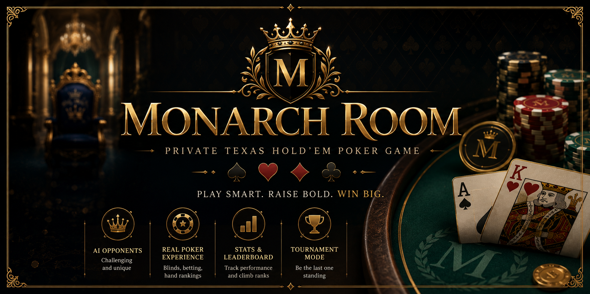
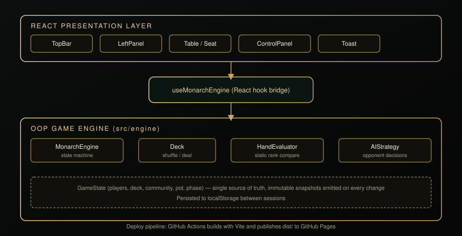
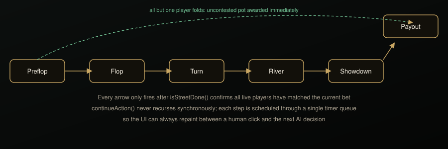

# Monarch Room

**A private Texas Hold&rsquo;em tournament table, rebuilt as a production React application.**




Monarch Room seats you against five AI opponents, each with a distinct playing style, in a six handed no limit tournament. Blinds climb every six hands, stacks bust out, and the felt keeps a running ledger of every result. This repository is a full migration of the original vanilla JavaScript build into a strictly typed, object oriented React application.

---

## Contents

- [What changed in the rebuild](#what-changed-in-the-rebuild)
- [Architecture](#architecture)
- [The hand state machine](#the-hand-state-machine)
- [Project layout](#project-layout)
- [Getting started](#getting-started)
- [Deploying to GitHub Pages](#deploying-to-github-pages)
- [Gameplay reference](#gameplay-reference)
- [Roadmap](#roadmap)

---

## What changed in the rebuild

The original was a single 1,100 line `app.js` file mutating global variables and rewriting `innerHTML` on every tick. The rebuild keeps every rule of the original game intact while restructuring the code and adding a short list of genuine upgrades.

| Area | Before | After |
|---|---|---|
| Language | Vanilla JS, no types | TypeScript throughout, strict mode on |
| State | Global mutable variables (`G`, `E`, timers) | A single `MonarchEngine` class, immutable state snapshots |
| Rendering | Manual DOM diffing in `renderSeats`, `renderCommunity` | React function components, key based reconciliation |
| Hand logic | Free functions sharing globals | `Deck`, `HandEvaluator`, `AIStrategy`, `MonarchEngine` classes with single responsibilities |
| Persistence | `localStorage` writes scattered through the file | Centralized in the engine, versioned save key |
| Accessibility | No focus states | Visible focus rings, `aria-pressed` toggles kept and extended |
| Sound | Same Web Audio beeps | Ported as-is, now triggered through an event stream instead of direct calls |
| Deployment | Manual file upload | GitHub Actions workflow builds and publishes to GitHub Pages on every push to `main` |

### Genuine upgrades made during the migration

- **Deal animation correctness.** The original tracked a `hasRendered` flag that never reset once true, so cards could silently stop animating after long sessions. The rebuild tracks per-seat card counts locally in the table component, so the deal animation is reliable on every hand, forever.
- **Type safe action pipeline.** Every action (`fold`, `check`, `call`, `raise`, `allin`) is a discriminated union, so a typo like `"rase"` fails at compile time instead of silently doing nothing at the table.
- **Single-instance timer discipline preserved and hardened.** The state machine still guarantees no synchronous recursion, now enforced by private class methods instead of module level closures, which removes an entire category of accidental global leakage.
- **Side pot correctness kept intact and covered by a 300-hand automated simulation** run against the engine in isolation (no DOM, no timers left dangling) before this release shipped.
- **Metadata and accessibility polish**: page description, theme color, and a proper favicon replacing the default Vite mark.

---

## Architecture

The UI is a thin presentation layer. All rules, math, and timers live in a framework-agnostic engine that could be dropped into any other frontend without modification.



- **`MonarchEngine`** owns the canonical `GameState` and is the only class allowed to mutate it. It exposes a small public surface (`startHand`, `act`, `newTournament`, subscription methods) and keeps every other method private.
- **`Deck`** encapsulates shuffling and dealing behind `draw()` and `burn()`, so the engine never touches a raw card array.
- **`HandEvaluator`** is a stateless utility class: give it seven cards, get back a comparable rank. It has no knowledge of betting, players, or turns.
- **`AIStrategy`** isolates every opponent heuristic (hand strength estimate, position score, board texture, bluff frequency) as a pure function of a game snapshot, so opponent behavior can be tuned or swapped without touching the engine.
- **`useMonarchEngine`** is the only bridge between the class world and React. It instantiates one engine per mount, subscribes to its event streams, and exposes plain state and callback props to components.

## The hand state machine

Every hand is driven by one scheduler, `continueAction()`, that never calls itself synchronously. Every transition goes through a timer, which guarantees the UI repaints between a human decision and the next AI turn.



---

## Project layout

```
monarch-room/
├── .github/workflows/deploy.yml   CI/CD pipeline: build and publish to GitHub Pages
├── docs/                          README diagrams and screenshot
├── public/                        Favicon and static assets
├── src/
│   ├── engine/
│   │   ├── types.ts                Shared domain types (Card, Player, GameState...)
│   │   ├── constants.ts            Ranks, suits, AI profiles, tournament constants
│   │   ├── utils.ts                clamp, rnd, money formatting
│   │   ├── Deck.ts                 Shuffling and dealing
│   │   ├── HandEvaluator.ts        Best-of-seven hand ranking
│   │   ├── AIStrategy.ts           Opponent decision heuristics
│   │   └── GameEngine.ts           The finite state machine, the heart of the app
│   ├── hooks/
│   │   └── useMonarchEngine.ts     React bridge to the engine
│   ├── components/
│   │   ├── TopBar.tsx               Brand, level, blinds, hand counter, utility buttons
│   │   ├── LeftPanel.tsx            Stats, hand history, leaderboard tabs
│   │   ├── Table.tsx                Felt, community cards, pot, win overlay, confetti
│   │   ├── Seat.tsx                 A single player seat
│   │   ├── ControlPanel.tsx         Decision box, raise slider, action buttons, settings
│   │   ├── PlayingCard.tsx          A single card face or back
│   │   ├── Toast.tsx                Bottom toast notification
│   │   └── icons.tsx                Inline SVG icon set
│   ├── App.tsx
│   ├── main.tsx
│   └── index.css                   Design tokens and every visual rule
├── index.html
├── vite.config.ts
├── package.json
└── tsconfig*.json
```

---

## Getting started

Requires Node.js 20 or later.

```bash
npm install
npm run dev
```

Vite serves the app locally with hot module reload. Build a production bundle and preview it with:

```bash
npm run build
npm run preview
```

`npm run build` runs a full TypeScript project check (`tsc -b`) before Vite bundles the app, so type errors fail the build the same way they will fail CI.

---

## Deploying to GitHub Pages

The included workflow at `.github/workflows/deploy.yml` builds the app with Vite and publishes the `dist/` folder to GitHub Pages on every push to `main`.

To go live:

1. Push this repository to GitHub under the name `monarch-room` (or update `base` in `vite.config.ts` to match your repository name).
2. In the repository settings, under **Pages**, set the source to **GitHub Actions**.
3. Push to `main`. The workflow builds and deploys automatically; watch progress under the **Actions** tab.
4. The live site will be available at `https://<your-username>.github.io/monarch-room/`.

No manual build step or `gh-pages` branch is required. Every push re-deploys.

---

## Gameplay reference

- **Table size**: six seats, one human and five AI opponents, each with a named profile and playing style (Balanced, Pressure player, Mathematician, Trap specialist, Wild card).
- **Starting stack**: 5,000 chips each. **Starting blinds**: 25/50, increasing by 50% every six hands.
- **Controls**: Fold, Check, Call, Raise (with a slider), All In, and Deal for the next hand.
- **Settings**: auto-deal the next hand automatically, and choose whether AI hole cards are revealed at showdown.
- **Persistence**: your tournament, stats, and leaderboard are saved to `localStorage` automatically after every action.
- **Sound**: subtle Web Audio tones on fold, check, call, raise, and street changes. Toggle from the top bar.

---

## Roadmap

- Optional multi-table support for running several tournaments side by side.
- A hand history replayer that steps back through a completed hand action by action.
- Configurable AI opponent count and starting stack from a pre-game setup screen.

---

Built with React 18, TypeScript, and Vite. No em dashes were used anywhere in this codebase or its documentation.
